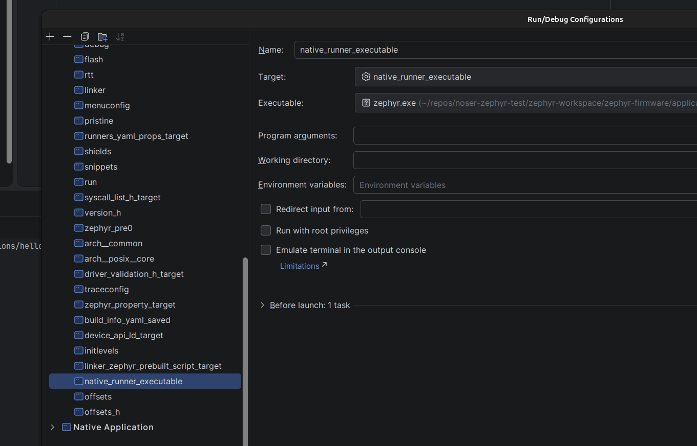

### Run/Debug application

```shell
zephyr-workspace/zephyr-firmware/applications/hello_equal$ west build --pristine=always -b native_sim -t run
```

### CLion

Run configuration for clion with native_sim (run and debug)



